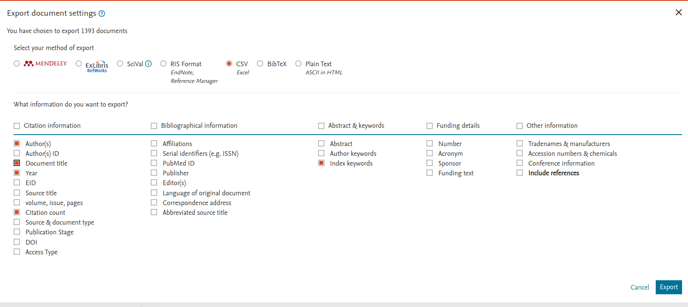

## Repository

```sh
git clone https://gitlab.com/fernando.delunogarcia/nilm-scopus.git
mkdir nilm-scopus.git/outputs
```


## Python settings

Enviornment:

```sh
cd nilm-scopus
python3 -m vevn env
. env/bin/activate
python -m pip install -r requirements.txt
```

## Scopus

Update your dataset by downloading the Scopus CSV file [through this link](https://www.scopus.com/search/submit/citedby.uri?eid=2-s2.0-0026970695&src=s&origin=resultslist).



## Dashboard

```sh
streamlit run nilm_scopus.py
```